# Hands On Long Term, Mid Term and Short Term Forecasting with Polynomial Regression, AutoARIMA and TimeGPT-1

**Forecasting is a set of computational techniques aimed at predicting future values of a time series based on historical patterns**.
However, the choice of techniques, evaluation metrics, and data requirements depends heavily on how far into the future we're trying to forecast.

For example, if we want to know **how hot it will be in New York over the next three years (long term forecasting)**, we probably don't need, nor would it be helpful, to have minute-level time series data. The dataset will be noisy and it will "distract" the algorithm from the big picture. Instead, it would be far more useful to have NYC weather records from, say, 1925 to 2025, to predict what might happen in 2026, 2027, and 2028.

On the other hand, if we're dealing **with finance and need to predict a stock price over the next hour**, very granular data (e.g., updates every minute) becomes crucial (**short term forecasting**). Here, the rapid variactions are far from being just "noise". Actually, such granular data enables the algorithm to capture the subtle and rapid fluctuations of the market.

There is also a grey area. For example, if we are trying to **forecast electricity demand in a city for the next few weeks (mid term forecasting)**, we don’t need minute-by-minute data, but we also can’t rely only on yearly averages. In that case, daily data from the past few months would strike a good balance, as they capture both seasonal trends and recent shifts in consumption patterns.

The algorithms suited for long-term, mid-term, and short-term forecasting are often quite different. Each task benefits from models that are tailored to its specific time horizon and data characteristics. In this blog post, we'll walk through a single forecasting problem and tackle it using three different approaches: one for long term forecasting, one for mid term forecasting, and one for short term forecasting. 

## Different Terms Forecasting Algorithm
Given a raw time series, the forecasting strategy depends on the time horizon we're targeting.
To handle long-term, mid-term, and short-term forecasts effectively, we can follow this structured approach:
* Start with the raw time series.
* Aggregate the data based on the desired time horizon (long, mid, short)
* Apply a forecasting model suited to that level of aggregation to generate future estimates.

